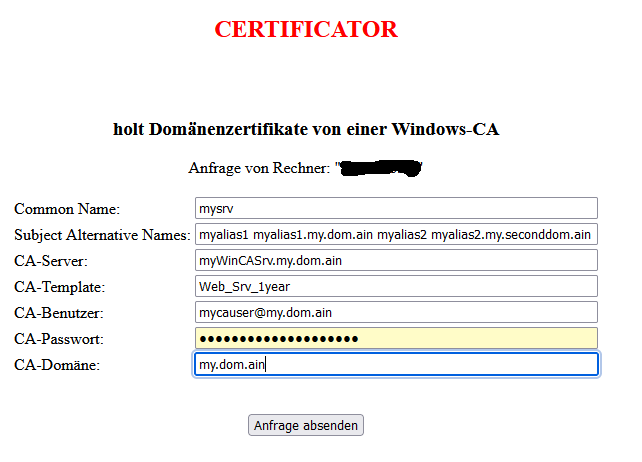
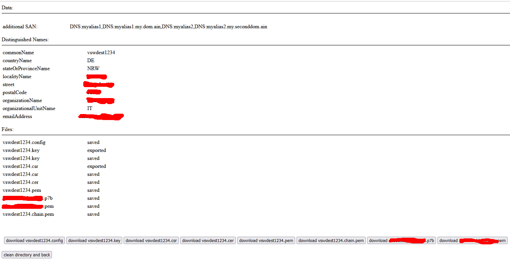

# certificator
vampyrize a windowscertificate from a Windows-CA  
get a key and certificate with Aliases as .cer, .pem, .chain.pem and cacertifcates as .p7b and .pem

## Requirements
  Windows-CA with cawe must be available  
  CAWE must have enabled basic authentication on https://mycasrv/certsrv/  
  a running template must exist and the user must be available to download a certificate from this.  
  a linuxhost with installed apache2, openssl, curl, mod-curl, mod-php  
  copy the ``certificator.php`` to e.g. ``/var/www/html/``  
  ``chown www-data certificator.php``  
  www-data should be writeable to ``/var/www/html/``  
## Using
  go to your webserver https://mylinuxhost/certificator.php  
    
  fill out all Entries in the dialogue with your informations.  
  if not needed, leave the SAN empty  
  and klick ``send Request``  
    
  then klick on the downloadbutton for the key and certificate that you need  
  after all klick on ``clean directory and back``.
  
